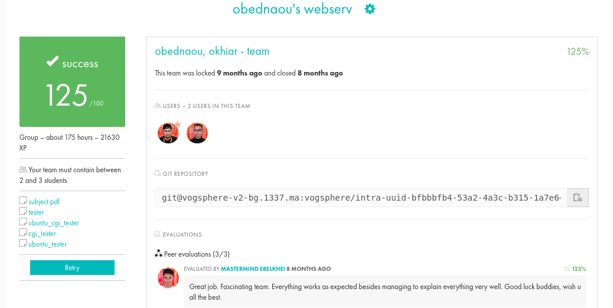

# 42_WEBSERV


## About

This project involved developing a lightweight web server in c++98, inspired by [Nginx](https://en.wikipedia.org/wiki/Nginx) and adhering to the HTTP 1.1 protocol as defined in the [RFC](https://datatracker.ietf.org/doc/html/rfc2616). The objective was to create a foundational understanding of web servers, networking protocols, and low-level socket programming in C++.
Here is the link to the [subject](https://cdn.intra.42.fr/pdf/pdf/109738/en.subject.pdf)

## Project Development:

**Config File Parsing**:

Implemented a robust config file parsing mechanism to read and interpret server configuration settings such as port number, document root directory, and other server parameters. 

**Multiplexing**:

Utilized select() to efficiently manage multiple client connections and handle I/O operations asynchronously. Implemented a scalable event-driven architecture to monitor and respond to multiple file descriptors, enabling concurrent handling of client requests without creating excessive thread overhead.

**Request parsing**:

Developed a robust request parsing module to parse incoming HTTP requests and extract essential information such as request method, request URI, HTTP headers, and request body (if applicable). Implemented logic to validate and sanitize input data, handle various HTTP methods (GET, POST, DELETE), and support parsing of query parameters.

**Response handling**:

Implemented a comprehensive response handling mechanism to generate appropriate HTTP responses based on the request received from clients. Supported various response status codes (e.g., 200 OK, 404 Not Found, 500 Internal Server Error...) and implemented logic to handle static file serving, and redirections as per HTTP standards. Ensured proper handling of HTTP headers, content type negotiation.

## What I learned from this project:

During the development of this project, We've learned several important concepts including:

- **C++ Programming**: Enhancing proficiency in C++ programming language, including memory management, data structures...

- **Networking Concepts**: Gaining a deeper understanding of networking concepts such as TCP/IP, HTTP, sockets programming, and network protocols.

- **Problem-Solving**: Throughout the development process, I encountered numerous challenges and setbacks. I experimented with various ideas, crafted multiple algorithms, many of which failed before I ultimately succeeded. This iterative approach allowed me to learn from each attempt, refine my strategies, and eventually overcome obstacles to achieve my objectives.

- **Error Handling**: Implementing robust error handling mechanisms to handle unexpected scenarios.

# My_42_project



## Installation && Usage

1. Clone the repository to your local machine:

   ```bash
   git clone git@github.com:Stilram19/webserv.git
   ```

2. Navigate to the repository's directory:

    ```bash
    cd webserv
    ```

3. Configure the server:
    for reference consult the [subject.](https://cdn.intra.42.fr/pdf/pdf/109738/en.subject.pdf)
    the default config file is config/default.conf.
   if you need to change the config file, go to Makefile and assign the new filepath to the ARGS variable.

5. Compile and Run the server:

   ``` bash
   make run
   ```

## Resources (for students):

[RFC](https://datatracker.ietf.org/doc/html/rfc2616)
